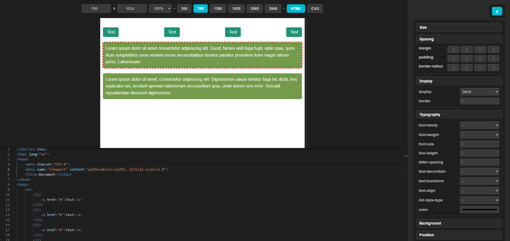

# EasyCoding MVP



This project is an **MVP** (Minimum Viable Product) and still under early-stage development.

The main goal of the app was to simplify writing frequently reused code blocks. While the idea works and the tool is functional, it turned out to be less efficient for my usual workflow. For now, I’ve decided to freeze active development.

---

## 🙌 Want to help?

If you're using this app and would like to improve it — feel free to reach out!  
You can email me or open an issue/pull request on GitHub. I’ll be happy to involve you in the project!

---

## 🧩 Features

- Minimal code editor with **Emmet support**  
- Switch between HTML and CSS tabs  
- Editor interface with real-time display  
- Simple layout: code editor on the right, live result on the left  
- Built using **React + Electron**

---

## 📦 How to use

### Option 1: Run in development mode

```bash
npm install
npm start
```


### Option 2: Build standalone EXE application

```bash
npm run dist
```